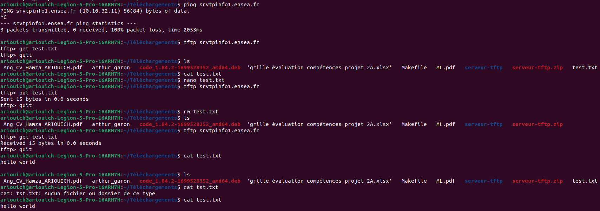

# Client-TFTP

Creation d'un client TFTP

On a utilisé la commande TFTP pour transférer ce fichier vers un serveur TFTP situé sur srvtpinfo1.ensea.fr.Le transfert s'est déroulé avec succès, comme indiqué par le message "Sent 15 bytes in 0.0 seconds" dans l'interface TFTP.
Par la suite, on a supprimé le fichier test.txt localement avec la commande rm et vérifié que le fichier a été supprimé avec succès en utilisant à nouveau la commande ls.
Ensuite, on a utilisé à nouveau la commande TFTP pour télécharger le fichier test.txt depuis le serveur TFTP. Le transfert a été réussi, comme indiqué par le message "Received 15 bytes in 0.0 seconds" dans l'interface TFTP. Et aprés on a vérifié le contenu du fichier téléchargé avec la commande cat et confirmé que le texte "hello world" était présent.

## Question 1
Dans cette partie on prend des arguments en ligne de commande pour définir des informations de requêtes, notamment le serveur (host), le nom du fichier à transférer (filename), le nom du fichier local (localfile), et, en option, le port (port). Le code utilise une fonction parse_arguments pour effectuer l'analyse des arguments et renvoyer les valeurs correspondantes à travers des pointeurs.

Dans la fonction main, les variables nécessaires (host, filename, localfile, ip) sont déclarées et passées à la fonction parse_arguments. Si la fonction réussit à analyser les arguments, elle renvoie EXIT_SUCCESS, sinon, elle affiche un message d'utilisation et renvoie EXIT_FAILURE. Cela permet au programme principal de déterminer si les arguments sont corrects.

La fonction parse_arguments vérifie d'abord si le nombre d'arguments est soit 4 (cas standard) ou 5 (cas optionnel avec le port). Ensuite, elle alloue dynamiquement de la mémoire pour stocker les valeurs des arguments et les copie à travers les pointeurs correspondants. Si le port est fourni en tant que cinquième argument, il est également stocké dans la variable port.

En fin de compte, le programme principal affiche un message d'utilisation et renvoie EXIT_FAILURE si la fonction parse_arguments échoue, sinon, il peut continuer à utiliser les valeurs des variables host, filename, localfile, et port pour effectuer d'autres opérations, comme le transfert de fichiers via TFTP.

Il est important de noter que le code assume que les utilisateurs fournissent les arguments corrects lors de l'exécution du programme et prend en charge la gestion de la mémoire pour les allocations dynamiques.

